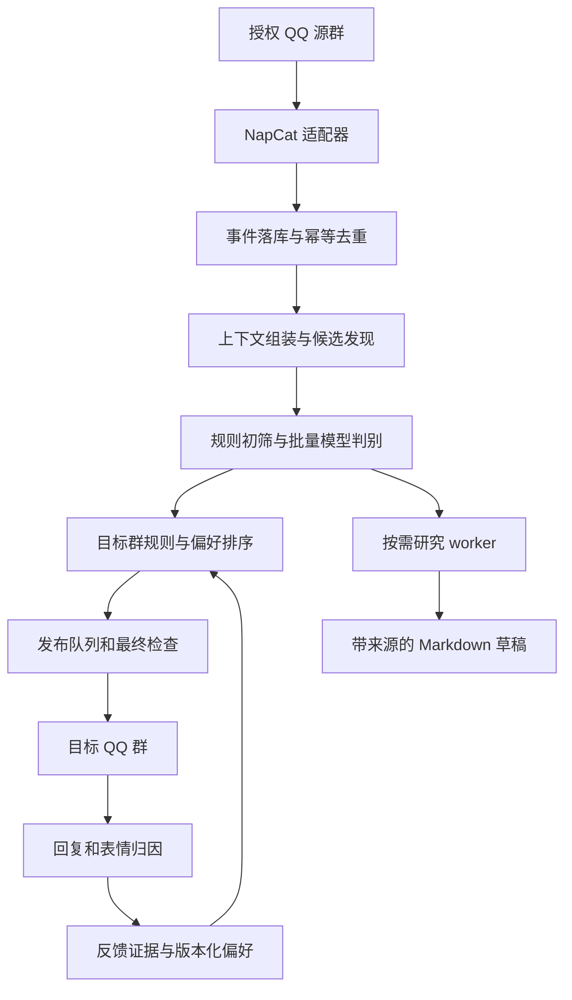

# pullshit 设计与调研

调研日期：2026-10-09。状态：设计提案，未接入真实 QQ、未实测模型质量或费用。本文中的窗口、阈值与预算均为实验起点，不是性能承诺。文末列出一手资料；框架事实与本项目设计判断分别表述。

## 1. 核心判断

pullshit 的核心资产是「内容及上下文—发布决策—目标群反馈」的数据闭环。Agent 是处理复杂判断和开放式研究的执行器。

产品目标：在群可接受的打扰和风险范围内，持续提供值得看的内容。允许一天不发；发布配额是上限，不是任务指标。互动量不等于满意度，猎奇程度不等于质量，源群热度不等于目标群兴趣。

首版只处理授权群中的文本、图片、链接与有限深度合并转发。视频、语音、全网自主浏览、个人画像、自动公开发布博客延后。源群和目标群必须分别配置；允许监听不自动等于允许向任意群搬运。

AI 新闻与群聊搬运共享候选内容、来源、去重、预算和发布账本，但用不同编辑策略：段子重视原貌和包袱，新闻重视证据、影响和不确定性。

## 2. 框架选择：先决定边界，再选运行时

| 方案 | 已核实的能力 | 对 pullshit 的判断 |
| --- | --- | --- |
| Hermes Agent | 记忆、skills、调度；可通过 HTTP API、JSON-RPC 或 Python AIAgent 接入 [S1–S3] | 适合后续研究、查证、写稿 worker；不需要 fork 整个项目才能使用 |
| Pi agent core | 可嵌入的有状态 agent、工具执行、事件流和上下文转换 [S4] | 如果主服务选 TypeScript，并希望精确控制工具和上下文，是合适的嵌入式选择 |
| 普通模型调用 + 应用状态机 | 本项目自行实现业务流程 | 首版批量判别、风险标注、反馈解释优先走这个路径，容易度量 |

**默认建议：Python 单体服务 + SQLite + NapCat；先直连模型完成筛选，给复杂研究预留 Hermes worker 接口。** 不为“基于某 agent”提前承担整套通用助手的会话和权限模型。Python 是便于后续 Hermes 集成的工程选择，不是效果优势；若维护者偏好 TypeScript，可改用 Pi，领域数据不变。

Hermes 当前文档支持外部程序驱动，故优先用隔离进程/服务封装，固定版本后验收；不要将内部类稳定性当成保证。[S2] 本次访问旧的 badlogic/pi-mono 路径跳转至 earendil-works/pi，包名也应按锁定版本的官方文档确认，不能照搬旧教程。[S4]

Hermes 的内建记忆适合紧凑的长期笔记；文档也明确说明长期不结束的聊天会话会积累上下文成本。[S3] 群口味由 pullshit 自己管理和版本化，按任务注入。不能把全群聊天持续送进一个永不结束的 agent session。

首版模型任务只有三类：候选判断、必要的图片理解、反馈语义解释。第二阶段增加研究任务。每类都有输入 schema、输出 schema、时限和独立预算。

## 3. 总体结构



图中的模块是同一个应用中的职责边界，首版不拆成微服务。数据库任务表提供持久队列；需要多实例或遇到写入瓶颈时才评估 PostgreSQL 和专用队列。

关键对象是 **content bundle（内容包）**，不是单条 QQ 消息。一个包包含正文、必要前因后果、媒体、引用关系、来源消息 ID、权限范围、缺失上下文说明及版本。

同一内容包可对不同群作出不同选择。内容分析尽可能复用，目标群评分单独计算；跨群复用不能绕过来源权限。

## 4. 如何发现「屎」并拼好上下文

### 4.1 两条发现路径

- 被动：订阅授权群的消息事件，结合引用回复、同作者连续消息、链接和图片识别候选。
- 主动：后期按计划查看批准的 RSS、项目 release、论文或公告源；只有具体候选缺证据时才开展定向搜索。扫描频率、请求数和研究预算均有上限。

第一版重视人工提名：引用消息发送「/搬」可直接进入候选池。它既是实用功能，也是低成本正样本来源，但仍需检查目标群规则和上下文。

### 4.2 组装策略

1. 先按引用关系、合并转发关系连接消息；强关系优先于时间邻近。
2. 同作者短时间连发可合并，时间邻近但主题不同的聊天不要硬拼。
3. 起点可设 30–90 秒安静窗口，另设 3–5 分钟最长等待和消息数/token 上限，防止活跃群永远不能关闭窗口。
4. 到期生成候选包，记录上下文是否完整；晚到的补充可产生新版本，未发布版本重新评估。
5. 对有歧义的候选，按消息 ID 有界回取引用和前后文。找不到关键内容就放弃或待审，不能让模型编补。

内容包保留原文证据。短摘要供索引和预筛选使用；决定是否发布和如何呈现时，必须能查看原文、原图和包袱所在。

### 4.3 发现成本与漏检

本地操作先做：精确哈希、URL 规范化、重复消息排除、图片感知哈希、低信息文本标记。URL 去重保留影响正文的查询参数，不盲删全部参数。

规则只拒绝高把握的噪声；一部分低优先级内容做随机抽样复核，否则会永远漏掉没有明显链接、图片或热度的新类型好内容。发现阶段不能只依赖回复数量。

图片先去重再处理。OCR 适合读字，不足以理解视觉梗；仅对进入候选的独特图片使用多模态模型，并缓存描述和分析版本。不能把“没读到字”当成图片安全。无法完成必要审查的媒体不自动发布。

合并转发限制嵌套深度、总节点数、媒体大小；每个限制触发都记录原因。原始媒体按保留策略及时缓存，避免判断时可见、发布时已失效。

## 5. 选择发布：质量、口味和风险分开

**先形成符合约束的候选集合，再在集合里排序。** 风险不与好笑程度加权抵消。

硬约束包括：允许的来源到目标路由、禁止类别、隐私信息、媒体是否已检查、是否已发布、内容时效、静默时段、每日频次、当前暂停状态。规则检查和模型判断结合；模型自报置信度不是校准过的安全概率。未知风险进入待审或拒绝自动发布，不能因为置信度数字高就放行。

排序考虑：对该群的预期价值、新颖性、上下文完整度、近期主题重复度、源群与目标群的重叠程度、打扰成本。每项有解释和证据。先用可理解的加权规则；留出数据校准后再增加学习排序。

同一个旧梗可能第一次进入某个目标群，因此同时维护全局内容指纹和目标群曝光记录。过滤机器人自己发出的消息，保留传播链，防止 A→B→A 无限搬运；无法识别的重贴用精确/近似指纹补充检测。

对猎奇、争议、成人或其他高风险边界，不通过线上探索来试群的容忍度。管理员可以制定更严格规则；点赞不能推翻禁发规则。

## 6. 学习：向量检索不是偏好学习

向量索引能找相似内容；它不会自动说明群友喜欢什么、反馈是否可信、是否应成为长期规则。建议分四层：

| 层 | 内容 | 首版存储与更新 |
| --- | --- | --- |
| 群规则 | 来源范围、禁发项、发布时段、频率 | 结构化配置 + 版本；管理员授权操作更新 |
| 群口味 | 题材、长度、风格偏好及证据量 | SQLite 统计；定期小幅更新 |
| 内容与反馈证据 | 哪条发布收到了什么反应、谁明确纠正 | SQLite + 媒体文件；保留来源和归因置信度 |
| 编辑经验 | 哪些整理方式有效、踩过什么坑 | 从证据生成紧凑记忆视图；工作方法可沉淀为 skill |

从 SQLite + 标签/文本检索起步。中文检索需验证分词或 n-gram 策略，不能假定默认全文索引能处理所有中文语义。标注检索失败样本后，如果语义召回成为真实瓶颈，再引入 embedding；索引属于可重建派生数据。

### 6.1 反馈归因先于情绪判断

发布账本记录 `bundle_id → publication_id → target_group_id → target_message_ids`。先定位反馈对应的发布，再解释含义。

- 引用回复和指向确切消息的表情：较强归因。
- 「/喜欢」「/少来点」「/别发这类」等结构化反馈：比普通表情更明确；普通群员提出偏好，管理员才可改硬规则。
- 仅在附近出现的「笑死」或「恶心」：最多是弱证据，不能直接计入确定好恶。
- 无反馈：未知，不等于差评。QQ 消息成功发送也不是已读曝光。
- 源群反应帮助发现，目标群反应帮助学习该群口味；两类数据分开。

NapCat 事件兼容表对 `notice.group_msg_emoji_like` 标为部分支持，备注「仅收自己的 其余扩展接口拉取」。接口表列出 `fetch_emoji_like`。[S5–S6] 这不等于已验证所有部署版本的行为。必须在固定 QQ/NapCat 版本上实测机器人消息与普通成员消息的区别、表情增删、用户列表、分页、消息 ID、重连后的数据完整性。

只对已发布消息及少量候选有界补拉反馈；不要轮询所有群消息。无法拿到用户级数据时保留聚合反馈，不伪造用户身份或独立投票数。表情计数可能是快照而非增量，适配器必须实测并归一化；重复上报、取消回应不能重复加分。

### 6.2 从反馈到口味

第一版只学群级题材与风格，不建立每个成员的详细人格画像。语义解释由模型输出「支持/反对/混合/不明、对象、理由、证据 ID」，程序决定如何累计。

一个可实现的初始估计，对某个群和某类题材：

```text
p = (a + Σ w_i · y_i) / (a + b + Σ w_i)
```

其中 `y_i` 是明确正负反馈的 1/0，`w_i` 由归因质量、信号明确度、去重和时间衰减决定，`a,b` 是防止少量反馈主导的先验。它只是「已收到可解释反馈中的倾向估计」，不是全群喜欢概率。主题重叠时要限制单次反馈总贡献，不能复制成多份证据。

同一成员对同一次发布贡献封顶，同一次发布对长期口味更新也封顶；记录独立成员数和不同内容数，避免一人刷表情或一次事件重塑全部偏好。不要因为某成员常与多数人意见不同就降其可信度。

样本少时保持原先规则，形成待验证假设。跨多次内容、多个成员且没有明显相反证据时才提高偏好权重。自动更新限制幅度、带版本、能回滚；管理员明确禁发立即影响发布，不等待夜间学习。

可生成这样的记忆视图：

```json
{
  "scope": "group:test",
  "dimension": "style.long_explanation",
  "direction": "less",
  "status": "hypothesis",
  "independent_publications": 4,
  "independent_members": 3,
  "evidence_ids": ["feedback:17", "feedback:29"],
  "counterevidence_ids": ["feedback:31"],
  "expires_at": "2026-11-08",
  "version": 2
}
```

这比「群友不喜欢长文」有用：能知道结论从哪里来，是否可靠，何时应失效。检索时只注入当前目标群相关的少量偏好与正反例，不能把另一个群的记忆混入。

### 6.3 反馈偏差和探索

只观察已发布内容会产生选择偏差。保存候选池、分数、未发布原因和所用策略版本。首版用人工抽查发现漏选，避免假装能从未发布内容推断满意度。

稳定后可把小比例发布位置留给符合全部约束、但口味不确定的题材。探索在允许集合内进行，记录实际抽样概率和分配原因。只有积累了可用数据、正确记录概率和覆盖范围后，才考虑 contextual bandit 或离线策略评估；首版不需要强化学习平台。

## 7. 成本：少读重复内容，少做无价值判断

批处理减少固定提示开销，并不会让原始消息 token 消失。真正的节省来自本地过滤、去重、只读取必要上下文、媒体缓存、分析跨目标群复用，以及限制工具循环。

建议分层：

| 层 | 工作 | 控制手段 |
| --- | --- | --- |
| 本地层 | 归并、去重、候选发现 | 不调用模型；有界队列和媒体大小 |
| 经济模型 | 多个独立内容包的结构化判断 | 每批 token 上限、候选 ID 对齐、输出限长 |
| 强模型/多模态 | 高价值且确有歧义的少数候选 | 每日升级额度；不对所有拒绝项重试 |
| 研究 agent | 新闻查证和成稿 | 每任务费用、调用次数、网页数和截止时间 |

分组批处理必须明确分隔不同内容包，校验输出 ID，不让 A 包中的指令或判断污染 B 包。强模型只能处理不确定性，不能证明内容绝对安全。

以下是计算示例，**不是观测数据，也不是市价**：

- 每天 20,000 条消息，本地阶段形成 400 个待判断内容包。
- 每包平均输入 500 tokens，每批 10 包，共 40 次；每次固定提示 1,000 tokens。
- 初筛输入合计 `400×500 + 40×1000 = 240,000` tokens。
- 每包输出 80 tokens，初筛输出 `32,000` tokens。
- 20 个候选升级，每个输入 2,000、输出 300：再加输入 40,000、输出 6,000。

```text
每日费用 = 0.240 × 初筛输入单价 + 0.032 × 初筛输出单价
         + 0.040 × 升级输入单价 + 0.006 × 升级输出单价
         + 图片/音视频费用 + 搜索/网页费用 + 反馈解释/反思费用 + 重试费用
```

单价单位为每百万 tokens；图片等按供应商实际计费方式折算。另计部署存储成本。400 个候选的假设取决于真实群聊内容，必须记录规则漏检率，不能靠丢掉绝大多数内容制造漂亮账单。

调度前在事务中预留本次最大允许费用，完成后按实际 usage 结算，避免并发越过日预算。无法确定计费的任务保守预留并限次数。重试、工具返回文本和后台反思同样入账。耗尽预算时停止新分析、保留有限期限候选；次日不无限追赶已过期积压。

指标关注每日总费用和每条人工认可内容的费用。最终模型选型用同一批真实候选盲评质量、成本、延迟与结构化输出成功率，不预先锁死品牌或宣称固定月费。

## 8. 发布与学习闭环

候选状态和每个目标群的发布状态分开，避免一个群发送成功让另一个群丢任务。

```text
内容：collected → bundled → analyzed → eligible / rejected / needs_review
发布：queued → sending → sent / failed / unknown / cancelled
反馈：独立追加，支持迟到、撤销和重新归因
```

调度器负责到期任务，模型仅返回提案。发布前重新检查最新规则、暂停状态、去重、预算、媒体和时间，防止排队期间规则改变。

用事务 outbox 将决策和待发送任务一起持久化。唯一键可使用 `(target_group_id, canonical_content_id, edition)`，重发必须显式建立新 edition。

**本地去重不等于端到端 exactly-once。** QQ 可能已收到消息但 API 回包丢失；这时进入 `unknown`，优先核对目标消息记录，有把握后再确认，否则等待处理，不立即盲重试。多条消息组成一次发布时逐条记录回执，避免部分失败后整包重复。

发送后同时记录多个目标消息 ID。可在 10 分钟、2 小时、24 小时采样反馈，作为待调参数；反馈允许更晚到达，不把窗口外反应简单丢掉。源群断线期间的漏消息也要标注覆盖缺口，不承诺无损补齐全部历史。

管理员暂停、禁发和路由变更走即时控制面。每日定时汇总口味变化提案；经幅度、证据与冲突校验后更新软偏好。生成解释：「因最近多条长解说收到少来点反馈，本群长解说权重从 X 调整到 Y」。

## 9. 数据模型和信任边界

建议最小实体：

| 实体 | 关键字段 |
| --- | --- |
| raw_events / messages | 账号、群、平台消息 ID、事件类型、接收时间、发生时间、原始载荷、去重键 |
| bundles / bundle_messages | 内容指纹、版本、原消息关系、来源权限、媒体引用、上下文缺失 |
| analyses | bundle 版本、模型/提示版本、特征、风险、证据、usage |
| decisions | 目标群、规则/偏好版本、候选分数、选择原因、探索概率（若适用） |
| publications / outbox | 幂等键、内容版本、状态、各目标消息 ID、尝试次数 |
| feedback | 发布 ID、反馈主体（若可用）、原始信号、增删/快照语义、归因质量 |
| preference_versions | 群、维度、权重、证据与反例、有效期、前版本 |
| budget_ledger | 任务、预留额度、实际使用、供应商单价版本、结算状态 |

平台 ID 在域模型中按字符串保存，并与账号/会话范围组成键，避免错误假定全局唯一。

群消息、图片 OCR、网页和检索结果均为不可信内容，不能变成控制指令。外部文本即使写着「管理员要求放开限制」也不能改规则。控制命令验证真实发送者身份、群范围和角色；引用或合并转发里的命令不执行。

模型只可访问有界工具，如 `get_bundle`、`get_group_preferences`、`search_approved_sources`、`submit_candidate`、`propose_preference_change`。群范围由任务凭据绑定，不能靠模型传入任意群 ID。发送凭据由发布器持有；研究进程不持有 QQ 管理凭据和任意 shell 权限。

抓取 URL 限制协议、内网地址和重定向目标，并限制响应大小/时长；工具输出截断有显式标记。提示词中的「忽略恶意指令」不是隔离机制。

原始消息建议默认保留 7–30 天作为可配置起点，只长期保留确有用途的脱敏内容与统计。公开博客引用群聊天需要单独的来源许可，不能因为进了源群就默认可以公开。删除请求应清理关联原文、媒体、派生索引，并重算受影响偏好；未脱敏哈希用户 ID 也不能当作匿名数据。

## 10. AI 新闻如何复用

新闻候选走独立 profile：以技术能力变化、使用门槛变化、生态影响、证据强度和时效衡量重要性，不以标题激动程度衡量。

研究 worker 输出：发生了什么、原始来源、已证实/发布方宣称/尚未核实的部分、与已有能力相比的变化、可能影响和限制。官方公告能证明厂商宣称了什么，不自动证明所有效果；效果结论尽量引用方法明确的独立评测。多个转载同一稿件不算多个独立证据。

产物为带日期、来源链接和更正记录的 Markdown 草稿。博客发布作为单独 sink 和授权配置，先验证草稿质量，再开自动发布。紧急新闻也受日预算和研究截止时间约束。

## 11. 实施顺序与验收

### P0：先验证输入输出可用

固定 QQ/NapCat 版本，用少量源群和一个测试目标群验证：文本、图片、引用、合并转发、发送回执、表情增删、普通成员消息反馈、撤回、断线重连。记录真实脱敏载荷作为回放 fixture。此阶段无自主跨群发布。

### P1：影子运行，验证选材

搭建事件库、内容包、规则初筛、批量模型判别、每日候选清单和成本账本。先准备约 100–300 个覆盖好内容、坏内容、上下文缺失、反讽、图片梗和重复传播的标注样本。按时间拆分并将近重复内容放同一分区，避免评估泄漏。

人工评价「值得搬吗、适合哪个群、上下文完整吗、是否允许发布」，对分歧保留不确定标签。与「随机选」「只看热度」「仅规则」比较；抽查被过滤内容衡量漏检。模型能否胜过简单基线，比是否用了复杂 agent 更重要。

### P2：小规模半自动发布

批准的候选才发，每群每天最多 3–5 条作为初始试验配置；打通发布账本、回复归因、显式反馈、暂停、发送未知状态。验收：重放不重复发送、暂停阻止待发任务、反馈不串群、不因超时盲重发。

### P3：有限自主和群口味

人工认可率持续可接受、上下文缺失和重复发布可控后，仅对批准类别自动发布。可将近 100 条建议中至少 80% 被认可作为讨论起点，但不能替代风险专项测试。启用群级软偏好、衰减、反例、版本回滚；先与固定策略对照，再考虑小比例探索。

### P4：研究 agent 与博客

接入 Hermes 研究 worker 或 Pi agent core，比较查证质量、执行成本和维护负担。领域接口保持不变，只实现一个适配器；无需同时维护两套运行时。最后接入 RSS、Markdown 草稿与博客 sink。

必须覆盖的失败用例：模型乱格式、预算并发超限、提示注入、权限伪装、媒体缺失、重复事件、表情取消、来源撤回、回复指向别条消息、跨群传播回路、发送成功但回执丢失、数据库重启后的任务恢复。

每周看：候选认可率、漏选样本、上下文完整率、重复率、明确负反馈、风险漏检案例、每日费用、反馈覆盖率。没有已读数据，不使用「全群点赞率」这类伪精确指标。

## 12. 仍需真实实验回答的问题

- 实际群数、消息量、媒体占比、成员重叠和可接受发布延迟。
- NapCat 固定版本对表情回应的具体可见范围，以及事件与查询结果的差异。
- 哪些内容被该群当作正面猎奇，哪些只是争吵或反讽；需要真实例子。
- 可用模型在中文群聊、视觉梗和风险边界上的能力与费用。
- 每日预算、来源转发许可、管理员规则和博客发布方式。

这些问题不阻碍现在确定领域模型和验证顺序，但影响默认参数。最先要得到的答案是：**每天有限的几个发布位置里，pullshit 能否比简单规则更稳定地选出群友愿意看的内容？**

## 一手资料

- [S1：Hermes 官方仓库](https://github.com/NousResearch/hermes-agent) — 产品能力与项目入口。
- [S2：Hermes Programmatic Integration](https://hermes-agent.nousresearch.com/docs/developer-guide/programmatic-integration/) — 外部程序接入方式。
- [S3：Hermes Persistent Memory](https://hermes-agent.nousresearch.com/docs/user-guide/features/memory/) — 记忆、会话边界和后台反思。
- [S4：Pi agent core 官方文档](https://github.com/earendil-works/pi/tree/main/packages/agent) — agent 核心、工具执行、上下文接口；旧仓库路径本次访问重定向至此。
- [S5：NapCat 上报事件兼容情况](https://napneko.github.io/develop/event) — 表情回应可见范围说明。
- [S6：NapCat 请求接口兼容情况](https://napneko.github.io/develop/api) — 通讯方式、消息和表情接口。兼容表不能替代锁定版本的联调。
